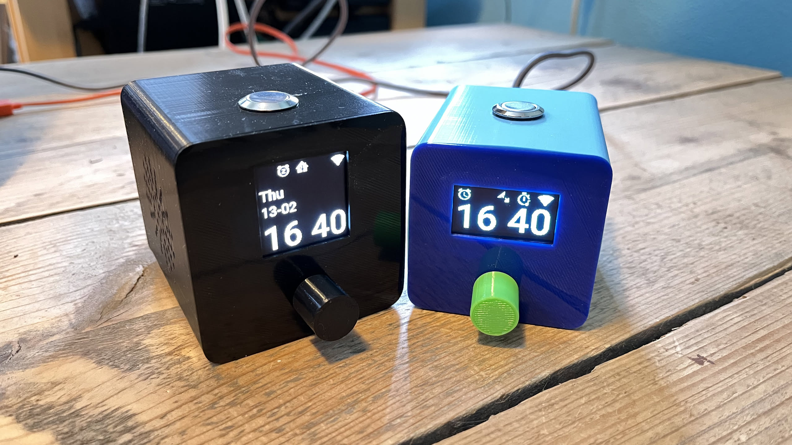

# System Of Alarm Sound - A cheap full featured alarm clock


|                                                                     |                             |
| ------------------------------------------------------------------- | --------------------------- |
|  |  |


## What?
ESPHome with Home Assistant integration?! "No shit, Sherlock". Well yes, all ESPHome has got HA integration, but SOAS has features that enables you to have HA automations based on your alarm time. So automations can be triggered based on the alarm time set on the alarm clock. There are 4 switches that will switch relative to the alarm time, you have the choice to enable the HA switch whether the alarm will sound or not. So the alarm does not have to sound for the HA automation to be triggered.

## Why?
This alarm clock is customizable, full featured and smart for under €35,-. It's a clock that can be managed through Home Assistant and (mostly) on the clock itself. The clock can be set while your partner is asleep, a tradional clock could be making noise. And, because of the smart features, you could for instance enable the heating in your home 15 minutes before the alarm sets off. Especially when your wake up schedule is not regular, this clock can make automations efficient by associating the triggers with your alarm time.

## Features
* Alarm based on time.
* Different display modes so there is more or less light emitted by the clock.
* Contrast based on day or night.
* 4 Home Assistant integrated switches that switch based on the alarm time, alarm does not have to sound. These switches can be switched manually on the clock itself.
* Customizable sleep timer.
* Customizable snooze timer.
* Online radio streams.
* Decent sound.
* Ability to hide the clock
* Volume increase of the alarm after a defined time of alarming
* Local file as fallback when internet is not available
* Volume increase of the alarm after a defined time of alarming
* Local file as fallback when internet is not available

## Requirements
* < €25,-
* 3d printer (not included in the price)
* ESP32-S3-N16R8 (https://nl.aliexpress.com/item/1005006418608267.html) ~ €6,-
* Oled screen
  - [SH1106](https://nl.aliexpress.com/item/1005007253095259.html) (128x64) ~ €2,50
  - [SH1107](https://nl.aliexpress.com/item/1005005313150711.html) (128x128) ~ €6,-
* MAX98357a amplifier ~ €3,-
* [3W speaker](https://nl.aliexpress.com/item/32593991938.html) ~ €3,-
* [Rotary button](https://nl.aliexpress.com/item/1005001877184897.html) < €1,-
* [Flat head button](https://nl.aliexpress.com/item/1005003400929705.html) ~ €1,50
* Dupont cables
* PLA
* Glue

## Optional

* A bit of soldering is not required, but the ground has to be shared so it is nice to solder that one. Depending on your rotary button, you maybe also need to do a little bit of soldering

## Installation

3d print [these](https://www.thingiverse.com/thing:7091731) files.

Connect all dupont cables corresponding the schema's below:

| SH1106 / SH1107 | ESP32  |
| --------------- | ------ |
| VCC             | 3v     |
| GND             | GND    |
| SCL             | GPIO47 |
| SDA             | GPIO48 |

| Rotary Button | ESP32  |
| ------------- | ------ |
| A             | GPIO9  |
| B             | GPIO10 |
| C             | GND    |
| D             | GND    |
| E             | GPIO8  |

| MAX98357a | ESP32   |
| --------- | ------- |
| LRC       | GPIO3   |
| BLCK      | GPIO1   |
| DIN       | GPIO2   |
| GND       | GND     |
| Vin       | 5v / 3v |
| MAX98357a | ESP32   |
| --------- | ------- |
| LRC       | GPIO3   |
| BLCK      | GPIO1   |
| DIN       | GPIO2   |
| GND       | GND     |
| Vin       | 5v / 3v |

| Flat head button | ESP32 |
| ---------------- | ----- |
| Switch           | GPIO4 |
| GND              | GND   |

Include the config below in your YAML. This one is made for a `ESP32-S3-N16R8`:
Include the config below in your YAML. This one is made for a `ESP32-S3-N16R8`:

```yaml
substitutions:
  display_model: "SH1107 128x128" #use "SH1106 128x64" for SH1106
  display_rotation: "270" #use 0 for SH1106
  sun_latitude: 52.37°
  sun_longitude: 4.89°
  i2c_sda: GPIO48
  i2c_scl: GPIO47
  i2s_lrclk_pin: GPIO3
  i2s_bclk_pin: GPIO1
  i2s_dout_pin: GPIO2
  pin_a: GPIO9
  pin_b: GPIO10
  alarm_off_button_pin: GPIO4
  rotary_button_pin: GPIO8
  alarm_file: alarm.flac
  language: "EN" #NL and DE are also supported
  alarm_file: alarm.flac
  language: "EN" #NL and DE are also supported

packages:
  remote_package_shorthand: github://skons/soas/alarm-clock-soas.yaml@main

time:
  - id: !extend ntp
    timezone: Europe/Amsterdam
    servers:
      - 0.pool.ntp.org
      - 1.pool.ntp.org
      - 2.pool.ntp.org

select:
  - id: !extend alarm_stream_url
    options:
      - "mp3 url to radio" #AAC seams to be making SOAS crash, FLAC or WAV will probably also work
      - "mp3 url to radio" #AAC seams to be making SOAS crash, FLAC or WAV will probably also work
  - id: !extend alarm_stream_name
    options:
      - "Friendly name of the radio station"

esphome:
  name: alarm-clock-soas
  friendly_name: Alarm Clock SOAS
  platformio_options: #PSRAM stuff
    build_flags: "-DBOARD_HAS_PSRAM"
    board_build.arduino.memory_type: qio_opi

esp32:
  board: esp32-s3-devkitc-1
  framework:
    type: esp-idf
  flash_size: 16MB

esp32:
  board: esp32-s3-devkitc-1
  framework:
    type: esp-idf
  flash_size: 16MB

psram:
  mode: octal
  speed: 80MHz
```

Save the `fonts` folder into your ESPHome folder. The folder needs to be placed in the same directory as your YAML.

Edit the `select` options with a stream URL and the name of the stream. To get some streams, install [radio browser](https://www.home-assistant.io/integrations/radio_browser/). Select a stream, send it to the clock and look at the ESPHome logging to view the URL of that stream.

Edit `alarm_file` to have your own local alarm. You can use mp3, wav or a flac file.

Edit `alarm_file` to have your own local alarm. You can use mp3, wav or a flac file.

## Usage

The rotary button is the button for accessing and editing configuration. When on a page, and there is no blinking of a configuration, you will automatically be redirected to the time page after 5 seconds of inactivity. The edit mode, blinking of a configuration, needs to be exited to return back to the time page. Entering and exiting the edit mode is done by single clicking the rotary button.

### Time page

#### Flathead short press
When the alarm, sleep timer and snooze are off, single press will switch the music on. If the sleep timer is enabled, the sleep timer will also switch to on.

If the sleep timer is on and the music is on, the music will be switched off.
When the alarm, sleep timer and snooze are off, single press will switch the music on. If the sleep timer is enabled, the sleep timer will also switch to on.

If the sleep timer is on and the music is on, the music will be switched off.

When the alarm is on, snooze will switch on and the alarm will go to off.

When snooze is on, the snooze will be switched off on single press.

#### Rotary single click
Single click of the rotary button toggles the alarm.

#### Rotary double click
Double click will bring you to the contrast page.

#### Rotary triple click
Triple click will bring you to the reboot page.

#### Display
Blinking of the alarm icon (most left icon) means that the radio is on. This happens when it is switched on manually or by the time set as alarm. When it is displayed, but not blinking it means the alarm is enabled. If the radio is on. the rotary button does not allow to switch pages but instead it will interact with the volume. If settings must be changed, the radio must be switched off.

The second icon is the snooze icon and tells you if snooze is on.

The Home Assistant icon is cut into 4 pieces. Left top is HA 1, right top is HA 2, left bottom is HA 3 and right bottom is HA 4. Is that part visible?, then that HA switch is enabled and it will go off relative to the alarm time. If it is blinking, then the HA switch is on. The on switch will be on for 1 minute and after that it will be automatically switched off.

Blinking of the sleep timer icon (second to last icon) means that the sleep timer is on. When it is displayed, but not blinking, the sleep timer is enabled.

The SH1107 display contains more pixel space, therefor the day of the week and date is displayed. The alarm time is also displayed, if snooze is on, then the time when the alarm will sound is displayed.

### Alarm page

#### Rotary single click
The alarm can be edited by single clicking the rotary button. This will make the time blink that is in edit mode. Single again and it will bring you to the minute. The rotary button is used to edit the hour or minute.

#### Rotary double click
Double click will enable or disable the alarm.

### Home Assitant page 1,2,3 and 4

This page displays if the Home Assistant switch is enabled, if the Home Assistant switch is associated with the alarm enabled and it shows the time relative to the alarm time. If the Home Assistant switch is enabled, it will switch to on even if the alarm is disabled.

#### Rotary single click
Single click of the rotary button will enable editing of the relative time, the rotary button can then be used to change the time.

#### Rotary double click
Double click will toggle the Home Assistant enabled switch and alarmed switch. The enabled switch (right top icon) means the HA switch will switch on relative to the alarm time. The alarmed switch (right bottom icon) means that is associated with the alarm being enabled. If HA is enabled, alarmed off, then the HA switch will switched based on the alarm time but the alarm does not have to be enabled. If HA is enabled and alarmed is switched on, then the HA switch will switch on only when the alarm is also enabled.

First double click will enable the enabled switch. The second double click will enable both enabled and alarmed switch. The third will disable both switches.

#### Rotary triple click
Triple click will switch the Home Assistant switch to on. This way it is possible to trigger your Home Assistant automation anytime you want. Regardless of the enabled and alarmed switched, and regardless of the alarm time.

### Sleep timer page

#### Rotary single click
With a single click with the rotary button you can define how long the music will play until it goes off.

#### Rotary double click
Double click will enable or disable the sleep timer.

### Radio page

Enter edit mode with a rotary button single click to select the station that will be used for the radio. Switching to a radio station means the radio will go on.

### Volume and contrast pages

The pages that are accessible from the time page are editable by rotating the rotary button. The contrast is depending on the day or night time. There is a different setting for both, and that can only be configured during that time.

### Restart page

Use the rotary button to select the correct option, single click the rotary button to restart or cancel your action.

### Options not available on the alarm itself

A few options are not (yet) available on the alarm self:
* Snooze duration
* Display Mode
* Hide clock
* Alarm volume increase
* Alarm volume increase duration
* Alarm volume increase
* Alarm volume increase duration

Use Home Assistant to configure these options.

## Display mode

There are 3 display modes:
* Full
* Minimum night only
* Minimum

The `Full` means that all is visible. The second indicator `:` will only blink during day time.

The `Minimum night only` will have a smaller font for less light. The wifi icon will not be displayed unless there is no wifi. The second indicator does not blink. This will only be displayed during night time.

`Minimum` is the same as `Minimum night only`, except that it is the mode also during daytime.

## Alarm volume increase

Define the time in seconds, `Alarm volume increase duration`, the alarm must sound before the amount of volume increase, `Alarm volume increase`, will be applied to make the volume go up. If one of the 2 is set to `0`, this feature is disabled.

## FAQ

### SH1107 SPI/I2C

Some SH1107 display modules support both I2C and SPI interface modes (one mode at a time). To switch to SPI mode, follow [this](https://simple-circuit.com/interfacing-arduino-sh1107-oled-display-i2c-mode/) tutorial and review [this](https://github.com/Skons/SOAS/issues/2#issue-3286014273) post.

## Alarm volume increase

Define the time in seconds, `Alarm volume increase duration`, the alarm must sound before the amount of volume increase, `Alarm volume increase`, will be applied to make the volume go up. If one of the 2 is set to `0`, this feature is disabled.

## FAQ

### SH1107 SPI/I2C

Some SH1107 display modules support both I2C and SPI interface modes (one mode at a time). To switch to SPI mode, follow [this](https://simple-circuit.com/interfacing-arduino-sh1107-oled-display-i2c-mode/) tutorial and review [this](https://github.com/Skons/SOAS/issues/2#issue-3286014273) post.

## ToDo

* Ability to save streamed url to local instead of having a list of streams (https://alshowto.com/home-assistant-and-esphome-how-to-series-1-step-3-make-a-simple-media-speaker/, see things that are quirky)

## Known issues
* If the variables have not been written to flash, playback could possible not restore if de clock crashes. Possible fix: https://community.home-assistant.io/t/flash-write-interval/401927/2
* If internet is down and SOAS decides to restart, time will not be set

## Changelog

### 2025.8.25.2
  - Fixed that the sleep timer disabled the alarm, not the new music switch

### 2025.8.25.1
  - **BREAKING** Switch to esp-idf framework
  - **BREAKING** With the switch to esp-idf pls stream urls do not work anymore
  - **BREAKING** on_boot is removed from the yaml, see `esphome:` above
  - **BREAKING** Flathead long press removed
  - **BREAKING** Music is added to distinguish between alarm sound and playing music (for sleep timer and the hardware button). If music is streamed to the device, it's not treated as an alarm anymore
  - Ability to increase the volume after a period of sounding the alarm [#5](https://github.com/Skons/SOAS/issues/5)
  - Local file can be added for when internet and/or home assistant is not available
  - Cosmetic updates to the yaml
  - When music is streamed to the clock, music_on will be switched on, enabling local controls
  - Volume is set to alarm_volume on stream stop, this is because of volume increase on alarm
  - Added I2C to SPI documentation, see issue [#2](https://github.com/Skons/SOAS/issues/2). Thanks @popy2k14
  - Language support for weekdays [#3](https://github.com/Skons/SOAS/issues/3)
  - Documentation updates

### 2025.8.25.1
  - **BREAKING** Switch to esp-idf framework
  - **BREAKING** With the switch to esp-idf pls stream urls do not work anymore
  - **BREAKING** on_boot is removed from the yaml, see `esphome:` above
  - **BREAKING** Flathead long press removed
  - **BREAKING** Music is added to distinguish between alarm sound and playing music (for sleep timer and the hardware button). If music is streamed to the device, it's not treated as an alarm anymore
  - Ability to increase the volume after a period of sounding the alarm [#5](https://github.com/Skons/SOAS/issues/5)
  - Local file can be added for when internet and/or home assistant is not available
  - Cosmetic updates to the yaml
  - When music is streamed to the clock, music_on will be switched on, enabling local controls
  - Volume is set to alarm_volume on stream stop, this is because of volume increase on alarm
  - Added I2C to SPI documentation, see issue [#2](https://github.com/Skons/SOAS/issues/2). Thanks @popy2k14
  - Language support for weekdays [#3](https://github.com/Skons/SOAS/issues/3)
  - Documentation updates

### 2025.7.14.1
 - ESP PSRAM implementation
 - Hide clock feature

### 2025.4.24.1
 - Time handling improvements
 - Solved issue #1
 - PIN assignment not hardcoded anymore

### 2025.4.8.1
 - Alarms are now more resillient, it runs as soon as it is missed
 - Multiple small improvements

### 2025.2.23.1
 - Multiple switches and numbers require time to be synced before their actions will take place, this makes sure settings will survive a reboot
 - Snooze and the sleep timer are more resillient when they miss their schedule due to a reboot
 - Multiple small bug fixes

### 2025.2.15.1
 - Playback will be restored after reboot

### 2025.2.14.1
- Number cleanup
- Switched to sliders instead of boxes for numbers
- Alarm volume number is not internal anymore

### 2025.2.13.1
- Initial commit